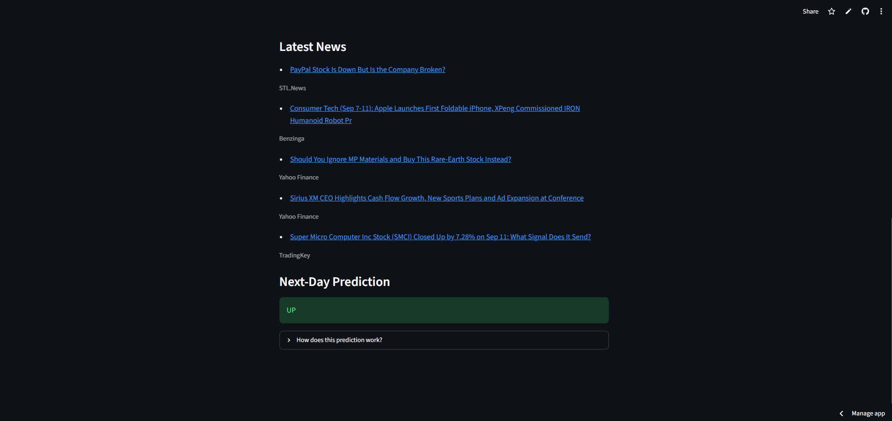

# AAPL Market Intelligence

### AI-Powered Stock Direction Prediction

</p>

An end-to-end financial machine learning application that combines **technical indicators** and **financial news sentiment** using **LSTM + FinBERT** to estimate the next-day direction of Apple (AAPL) stock.

[](https://www.python.org/)[](https://www.tensorflow.org/)[](https://pytorch.org/)[](https://huggingface.co/)[](https://streamlit.io/)[](https://github.com/ranaroussi/yfinance)[](https://www.alphavantage.co/)


## Live Demo

[**Open AAPL Finance AI**](https://aapl-financeai-gzgjdzvbvm3segt8ksw6qq.streamlit.app/)

## Overview

AAPL Finance AI combines market price information with financial news sentiment in an interactive Streamlit application. It brings together historical AAPL market data, technical indicators, financial news, FinBERT sentiment analysis, and LSTM sequence modeling to estimate the next-day direction of AAPL stock.

## Dashboard

The dashboard displays:

- Current AAPL price and daily return

- Five-day return and moving averages

- Twenty-day volatility

- Financial-news sentiment

- AAPL price history chart

- Latest news headlines

- Next-day UP/DOWN prediction
<p align="center">

<p align="center">

</p>

## Model Architecture

<p align="center">
  
</p>

## Technology stack

| Technology | Role in the project |
| --- | --- |
| **Python** | Application logic and data processing |
| **Streamlit** | Interactive dashboard and user interface |
| **yfinance** | Historical AAPL market data |
| **Alpha Vantage** | Financial-news data |
| **FinBERT** | Finance-specific sentiment analysis |
| **TensorFlow / Keras** | LSTM direction model |
| **PyTorch + Transformers** | Sentiment-model inference |

## Run locally

Follow these steps to run the dashboard locally.

### 1. Clone the repository

```bash
git clone https://github.com/samarth3868-coder/AAPL-FinanceAI.git
cd AAPL-FinanceAI
```

### 2. Install dependencies

```bash
python -m venv .venv
source .venv/bin/activate  # Windows: .venv\\Scripts\\activate
pip install -r requirements.txt
```

### 3. Configure Alpha Vantage

Create `.streamlit/secrets.toml`:

```
ALPHA_VANTAGE_API_KEY = "your_api_key_here"
```

### 4. Run the application

```bash
streamlit run app.py
```

## Repository files

| File | Description |
| --- | --- |
| `app.py` | Streamlit dashboard and prediction pipeline |
| `aapl_lstm_news_model.keras` | Trained LSTM model |
| `aapl_scaler.pkl` | Saved feature scaler |
| `aapl_features.pkl` | Saved model feature list |
| `aapl_daily_sentiment.csv` | Daily sentiment data |
| `P1.png` | Dashboard overview screenshot |
| `P2.png` | News and prediction screenshot |
| `model-architecture.png` | Model workflow and architecture diagram |
| `requirements.txt` | Python dependencies |

## Limitations

This project is designed for education and experimentation. It does not guarantee prediction accuracy, provide financial advice, or replace independent research. Market and news data may be delayed or temporarily unavailable. The model is trained for AAPL and should not automatically be applied to other securities.
