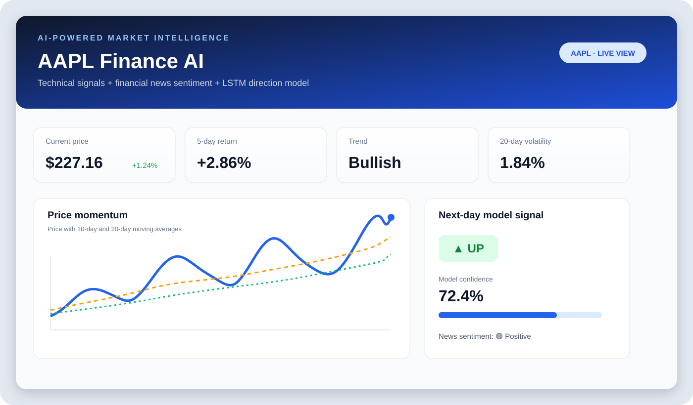
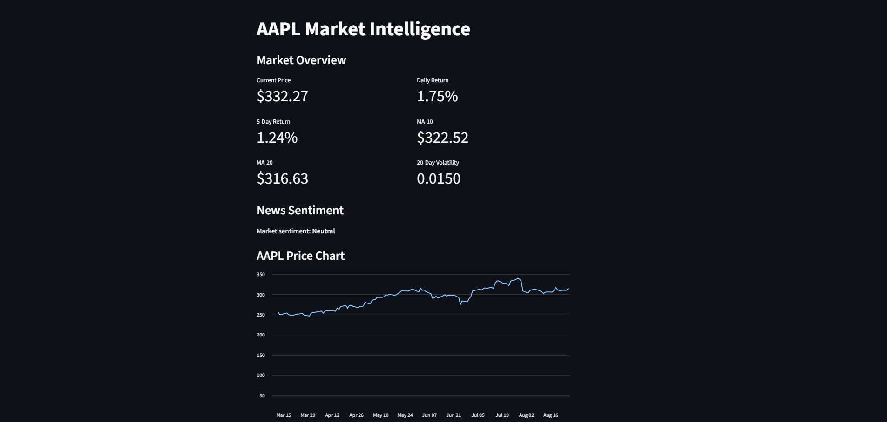
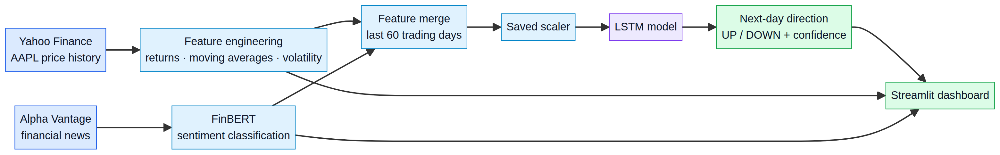

<div align="center">

# AAPL Market Intelligence

### AI-powered market intelligence for Apple stock

[](https://aapl-financeai-gzgjdzvbvm3segt8ksw6qq.streamlit.app/)[](https://www.python.org/)[](https://streamlit.io/)[](https://www.tensorflow.org/)[](https://pytorch.org/)

**A polished Streamlit dashboard combining technical indicators, financial-news sentiment, and an LSTM model to estimate AAPL's next-day direction.**

</div> <p align="center">

</p>

## Dashboard screenshot

<p align="center">
  
</p>

> **Educational project:** Model outputs are experimental signals, not investment advice or a guarantee of future returns.

## Why this project?

Financial analysis often requires bringing together structured market data and unstructured news. AAPL Finance AI demonstrates that workflow in one interactive product: it calculates price-based indicators, scores recent headlines with a finance-specific language model, and sends a rolling feature window to a trained LSTM direction model.

## Live demo

[**Open the AAPL Finance AI dashboard**](https://aapl-financeai-gzgjdzvbvm3segt8ksw6qq.streamlit.app/)

## Dashboard highlights

| Area | What it provides |
| --- | --- |
| Market snapshot | Current price, daily return, five-day return, trend, and 20-day volatility |
| Price momentum | Interactive chart with price, 10-day moving average, and 20-day moving average |
| AI signal | Next-day UP/DOWN direction estimate with model confidence |
| News intelligence | Recent AAPL headlines scored with ProsusAI/FinBERT |
| Explainability | Methodology panel describing features, model inputs, and limitations |
| Reliability | Cached resources and defensive handling for missing API data or incomplete windows |

## System architecture

<p align="center">

</p>

The model workflow is:

1. Download AAPL price history from Yahoo Finance.

1. Calculate daily returns, five-day returns, moving averages, volatility, and historical sentiment features.

1. Retrieve recent AAPL headlines from Alpha Vantage.

1. Classify headline sentiment with **ProsusAI/FinBERT**.

1. Merge the signals, scale the latest 60 trading days, and run the saved **Keras LSTM** model.

1. Display the direction estimate and confidence in Streamlit.

## Feature set

- `Daily_Return`

- `Return_5D`

- `MA_10`

- `MA_20`

- `Volatility_20D`

- Daily financial-news sentiment

## Project structure

```
AAPL-FinanceAI/
├── app.py                          # Streamlit dashboard and inference pipeline
├── aapl_lstm_news_model.keras      # Trained LSTM model artifact
├── aapl_scaler.pkl                 # Saved feature scaler
├── aapl_features.pkl               # Model feature order
├── aapl_daily_sentiment.csv        # Historical daily sentiment feature
├── requirements.txt                # Python dependencies
├── assets/
│   ├── dashboard-preview.svg       # README dashboard visual
│   ├── dashboard-screenshot.png    # Live dashboard screenshot
│   ├── architecture.mmd            # Editable Mermaid source
│   └── architecture.png            # Rendered architecture diagram
└── README.md
```

## Run locally

### 1. Clone the repository

```bash
git clone https://github.com/samarth3868-coder/AAPL-FinanceAI.git
cd AAPL-FinanceAI
```

### 2. Create an environment and install dependencies

```bash
python -m venv .venv
source .venv/bin/activate  # Windows: .venv\\Scripts\\activate
pip install -r requirements.txt
```

### 3. Configure Alpha Vantage

Create `.streamlit/secrets.toml`:

```
ALPHA_VANTAGE_API_KEY = "your_api_key_here"
```

The dashboard can still load market data without the key, but live news sentiment will be unavailable.

### 4. Start the dashboard

```bash
streamlit run app.py
```

## Technology stack

- **Streamlit** — interactive dashboard and presentation layer.

- **yfinance** — historical AAPL market data.

- **Alpha Vantage** — recent financial-news headlines.

- **ProsusAI/FinBERT** — finance-specific sentiment classification.

- **TensorFlow/Keras** — saved LSTM direction model.

- **PyTorch + Hugging Face Transformers** — sentiment inference.

## Adding your own README images

GitHub renders images from files committed inside the repository. The simplest workflow is:

1. Create an `assets/` folder in the repository.

1. Add an image such as `assets/dashboard.png`.

1. Reference it with a relative Markdown path:

```markdown

```

For a centered image with a controlled width, use HTML supported by GitHub:

```html
<p align="center">
  
</p>
```

For diagrams, keep the editable source file alongside the rendered image. This repository uses `assets/architecture.mmd` as the source and `assets/architecture.png` as the GitHub preview.

## Limitations and responsible use

This is a learning and experimentation project. It does not perform backtesting in the dashboard, provide a calibrated probability of returns, account for transaction costs, or guarantee accuracy. Market data and news APIs can be delayed, rate-limited, or temporarily unavailable. The model is trained for AAPL and should not be assumed to generalize to other securities without retraining and out-of-sample validation.

Use the dashboard to explore how alternative data and machine learning can be combined in a financial workflow. Conduct independent research and apply appropriate risk controls before making any financial decision.

## Author

Built by **Samarth** as an applied machine-learning project connecting time-series modeling, NLP, financial data, and product design.

<div align="center">

[**View the live demo**](https://aapl-financeai-gzgjdzvbvm3segt8ksw6qq.streamlit.app/)** · **[**Explore the code**](https://github.com/samarth3868-coder/AAPL-FinanceAI)

</div>
